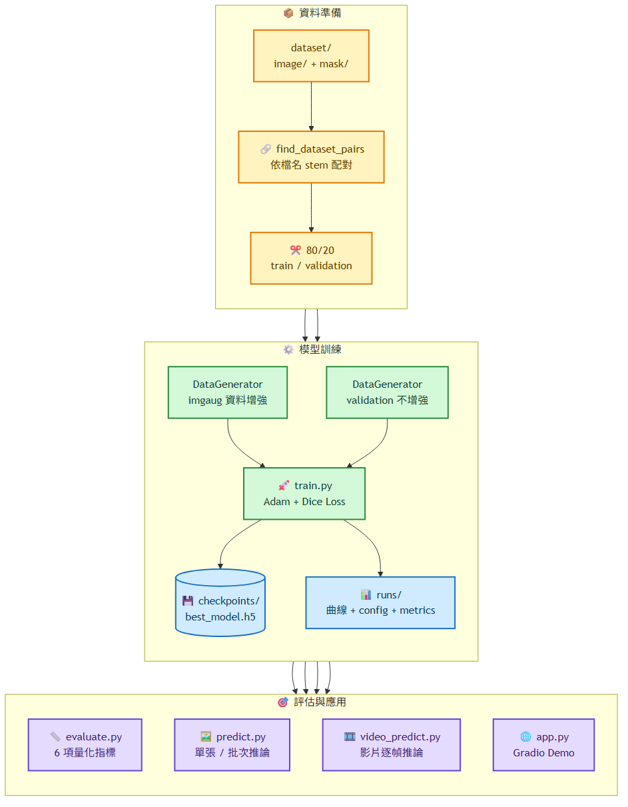
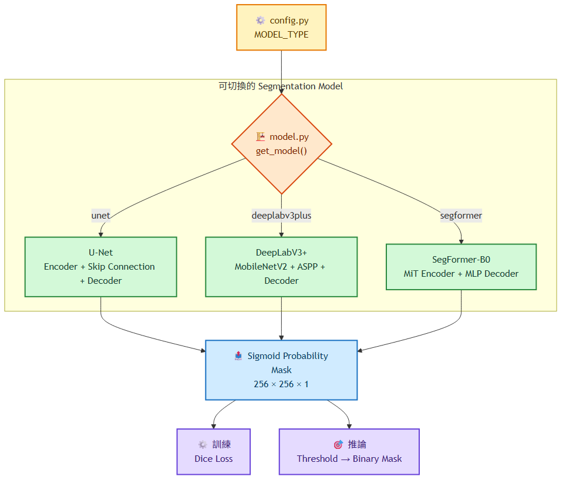
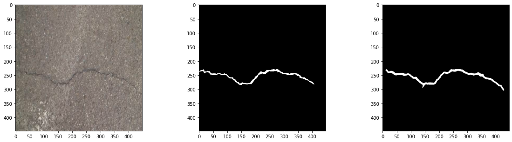
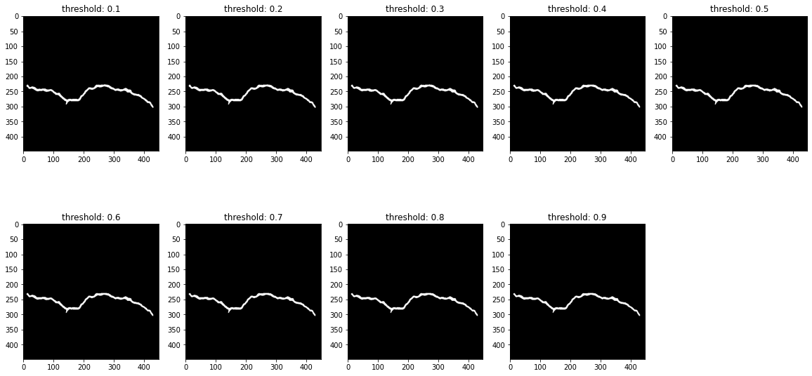
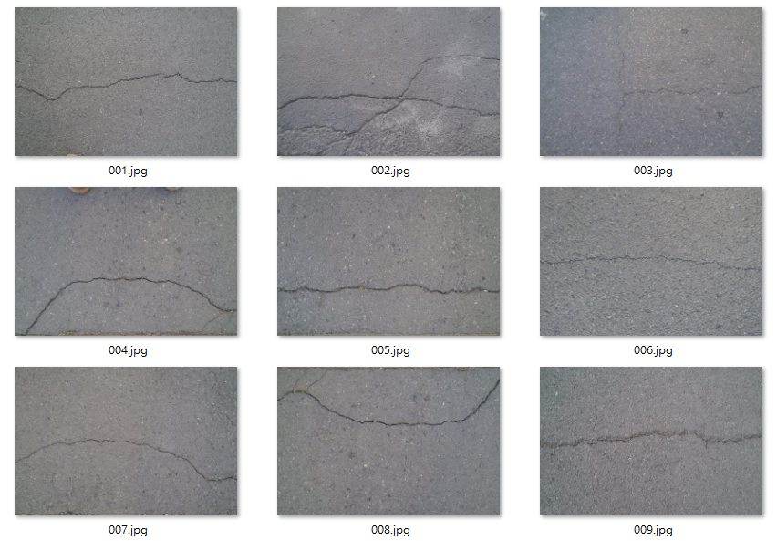
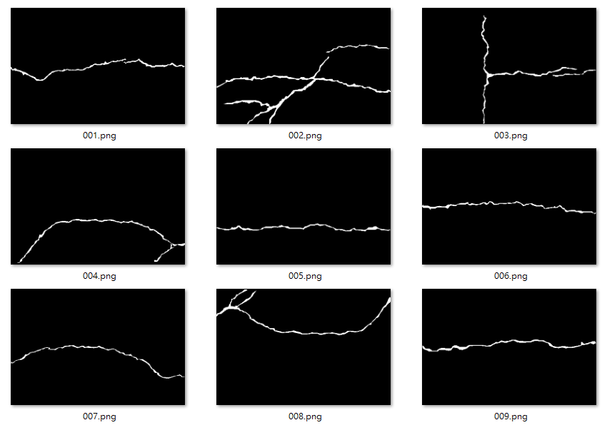
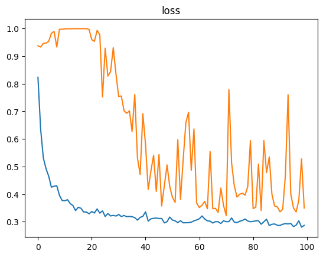
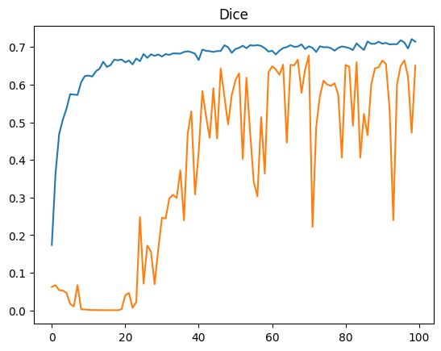

# Crack Segmentation


> **基於深度學習的路面裂縫語意分割系統**
> 支援 U-Net、DeepLabV3+、SegFormer 三種模型架構，提供訓練、批次推論、影片偵測與互動式 Demo 完整工作流程。

---

## 技術亮點

- **三種模型可切換**：輕量 U-Net（快速訓練）、DeepLabV3+（ASPP 多尺度）、SegFormer-B0（Transformer）
- **Dice Loss 訓練**：針對裂縫像素稀少的 foreground-sparse 特性設計，避免類別不平衡問題
- **完整推論工具鏈**：單張圖片、批次資料夾、影片逐幀均有對應腳本
- **量化評估**：Dice / IoU / Precision / Recall / F1 / Accuracy 六指標，自動輸出 CSV 與樣本網格圖
- **互動式 Demo**：Gradio Web UI，拖拉上傳即得疊加結果（可 `--share` 產生公開連結）
- **Docker 一鍵部署**：GPU / CPU 兩種模式，掛載外部資料集與模型
- **可重現實驗**：固定 random seed（含 imgaug 資料增強），訓練時輸出 `runs/config.json` 與 `runs/metrics.json`

---

## 系統架構

### 端到端工作流程

從影像與 Mask 配對開始，經過資料切分、資料增強與模型訓練，最後由同一份最佳權重支援評估、單張／批次推論、影片推論與 Gradio Demo。



[查看 Mermaid 圖源](docs/diagrams/readme_01_flowchart_project_workflow.mmd)

### 模型選擇架構

`config.py` 的 `MODEL_TYPE` 透過 `model.py:get_model()` 統一建立三種模型，並維持相同的單通道 Sigmoid Probability Mask 輸出介面。



[查看 Mermaid 圖源](docs/diagrams/readme_02_flowchart_model_architecture.mmd)

---

## 成果展示

以下結果為 U-Net 模型在 [Crack Segmentation Dataset](https://www.kaggle.com/datasets/lakshaymiddha/crack-segmentation-dataset) 上的一次訓練輸出，訓練 Dice 收斂至約 **0.70**。
如需驗證集量化指標（Dice / IoU / Precision / Recall），下載資料集並訓練後執行：

```bash
python evaluate.py --data_path dataset/ --model_path checkpoints/best_model.h5 --split val
```

**單張影像預測**（左：原始影像 / 中：Ground Truth / 右：預測 Mask）：



**二值化閾值靈敏度**：同一張影像在 threshold 0.1–0.9 下的預測結果幾乎一致，代表模型輸出的機率分布兩極化、裂縫邊界明確：



**訓練資料樣本**（左：影像 / 右：對應 Ground-Truth Mask）：

| 訓練影像 | Ground-Truth Mask |
|:---:|:---:|
|  |  |

**訓練曲線**：

| Loss | Dice Coefficient |
|:---:|:---:|
|  |  |

---

## 任務說明

模型從路面影像中預測裂縫區域：

- **輸入**：RGB 路面影像
- **輸出**：單通道裂縫機率圖 → 二元 Mask（經閾值化）

裂縫分割屬於 **foreground-sparse segmentation task**（裂縫像素遠少於背景），訓練使用 **Dice Loss** 應對類別不平衡問題。

---

## 資料集

使用 [Crack Segmentation Dataset (Kaggle)](https://www.kaggle.com/datasets/lakshaymiddha/crack-segmentation-dataset)：

- 超過 11,000 張路面 / 牆面裂縫影像
- 每張影像附有同名二值 Ground-Truth Mask
- 涵蓋多種裂縫形態（網狀、縱向、橫向）

下載後解壓縮至專案根目錄 `dataset/` 並確保以下結構：

```text
dataset/
  image/   ← RGB 路面影像（.jpg / .png）
  mask/    ← Ground-truth 二值 Mask（同名）
```

---

## 支援模型

| 模型 | 特色 | 適用情境 |
|------|------|---------|
| **U-Net** | 輕量 Encoder-Decoder + Skip Connection | 快速訓練、資源受限 |
| **DeepLabV3+** | ASPP 多尺度特徵 + MobileNetV2 backbone | 精度要求較高 |
| **SegFormer-B0** | Transformer Encoder + MLP Decoder | 最高精度，需較多 GPU 記憶體 |

在 `config.py` 設定 `MODEL_TYPE` 或以 `--model_type` 參數切換。

---

## 快速開始

### 1. 環境安裝

推薦使用 conda（含 GPU 支援）：

```bash
.\setup_env.ps1
conda activate crack_seg
```

或手動安裝：

```bash
conda create -n crack_seg python=3.9 -y
conda activate crack_seg
conda install -c conda-forge cudatoolkit=11.2 cudnn=8.1.0 -y
conda install "pip=23.1.2" -y

pip install tensorflow==2.10.0
pip install --no-deps "opencv-python==4.8.1.78"
pip install matplotlib tqdm scikit-learn gradio imgaug
pip install "numpy==1.24.0" --force-reinstall

# 可選：使用 SegFormer 模型時需加裝
pip install transformers
```

> **為什麼是 TensorFlow 2.10 + Python 3.9？** TF 2.10 是最後一個支援 Windows 原生 GPU（CUDA）的版本，本專案以 Windows 工作站訓練為主要情境，故鎖定此組合以避免 WSL2 依賴。Linux / Docker 環境不受此限制。

若只需要在 CPU 環境執行測試，可使用 CI 專用依賴：

```bash
pip install -r requirements-ci.txt
python -m pytest tests/ -v
```

### 2. 準備資料集

```text
dataset/
  image/        ← 路面影像（.jpg / .png）
  mask/         ← Ground-truth 裂縫 Mask（同名，二值圖）
```

影像與 Mask 依**檔名 stem** 配對（例如 `image/001.jpg` ↔ `mask/001.png`）。

更新 `config.py` 中的 `DATA_PATH`，或在指令中以 `--data_path` 傳入。

> **資料集來源**：[Crack Segmentation Dataset (Kaggle)](https://www.kaggle.com/datasets/lakshaymiddha/crack-segmentation-dataset)

### 3. 模型權重與大檔案

`dataset/`、`checkpoints/`、`outputs/`、`runs/` 都已列入 `.gitignore`，資料集、模型權重與訓練產物不會提交到 Git。

本專案**不附帶預訓練權重**，請依下一節指令自行訓練（亦可使用 `colab_train.ipynb` 在 Google Colab 免費 GPU 上訓練）。訓練完成後最佳模型會儲存於：

```text
checkpoints/
  best_model.h5
```

推論、評估與 Gradio Demo 均以此路徑為預設值。

### 4. 訓練

```bash
# 使用預設 U-Net
python train.py --data_path dataset/ --seed 42

# 使用 DeepLabV3+
python train.py --data_path dataset/ --model_type deeplabv3plus --epochs 50 --seed 42

# 使用 SegFormer（需先 pip install transformers）
python train.py --data_path dataset/ --model_type segformer --seed 42
```

訓練完成後模型儲存至 `checkpoints/best_model.h5`，訓練曲線圖、實驗設定與摘要指標輸出至 `runs/`。

### 最小可行工作流程

首次使用時，可依下列順序完成一次從訓練到推論的流程：

```bash
# 1. 訓練模型
python train.py --data_path dataset/ --seed 42

# 2. 僅在驗證集評估模型
python evaluate.py --data_path dataset/ --model_path checkpoints/best_model.h5 --split val

# 3. 對單張影像進行推論
python predict.py --image_path path/to/image.jpg --model_path checkpoints/best_model.h5
```

完成訓練後，`runs/` 會包含 Loss、Dice、IoU 的個別曲線，以及便於快速比較的 `history_summary.png`；評估結果則會輸出為 CSV 與範例影像網格。

---

## 完整 CLI 指令

### 單張影像推論

```bash
python predict.py \
  --image_path path/to/image.jpg \
  --model_path checkpoints/best_model.h5 \
  --output_path outputs/mask.png \
  --overlay_path outputs/overlay.png \
  --threshold 0.5
```

### 批次推論

```bash
python predict.py \
  --input_dir path/to/images/ \
  --model_path checkpoints/best_model.h5 \
  --output_dir outputs/ \
  --threshold 0.5
```

輸出結構：

```text
outputs/
  masks/                  ← 二元 Mask
  overlays/               ← 紅色疊加視覺化
  prediction_summary.csv  ← 裂縫像素數、比例、平均機率
```

### 影片推論

```bash
python video_predict.py \
  --video_path road.mp4 \
  --model_path checkpoints/best_model.h5 \
  --output_video outputs/annotated.mp4 \
  --output_csv outputs/frame_stats.csv \
  --threshold 0.5 \
  --skip_frames 2        # 隔幀推理，加速 2x
```

### 模型評估

```bash
python evaluate.py \
  --data_path dataset/ \
  --model_path checkpoints/best_model.h5 \
  --split val \
  --threshold 0.5 \
  --csv_path outputs/evaluation_metrics.csv \
  --samples_output outputs/evaluation_samples.png
```

評估指標：Dice、IoU、Precision、Recall、F1-score、Accuracy。

`--split val`（預設）會以與訓練相同的 seed 重現 80/20 切分，只在**驗證集**上評估，避免訓練資料灌水指標；`--split all` 則評估整個資料集（例如評估另一份模型沒看過的資料）。

### 互動式 Gradio Demo

```bash
python app.py --model_path checkpoints/best_model.h5
# 開啟瀏覽器：http://localhost:7860
```

---

## Docker 部署

```bash
# GPU 模式
docker compose up

# CPU-only 模式（無 NVIDIA GPU）
docker compose -f docker-compose.yml -f docker-compose.cpu.yml up

# 只執行訓練
docker compose run crack-seg python train.py --data_path dataset/
```

> 使用 GPU 需安裝 [NVIDIA Container Toolkit](https://docs.nvidia.com/datacenter/cloud-native/container-toolkit/install-guide.html)。

---

## 專案結構

```text
crack_SEG/
├── config.py               # 全域超參數設定（IMG_SIZE, MODEL_TYPE 等）
├── model.py                # U-Net / DeepLabV3+ / SegFormer 模型定義
├── data_preprocessing.py   # DataGenerator（Keras Sequence + imgaug 增強）
├── train.py                # 訓練流程（Dice Loss, EarlyStopping）
├── predict.py              # 單張 / 批次影像推論
├── video_predict.py        # 影片逐幀裂縫偵測
├── evaluate.py             # 量化評估（6 指標 + CSV + 樣本網格）
├── segmentation_utils.py   # 影像 I/O、Mask 處理、指標計算共用函式
├── app.py                  # Gradio 互動式 Demo
├── colab_train.ipynb       # Google Colab 訓練筆記本（免費 GPU）
├── requirements.txt        # pip 相依套件（含安裝注意事項）
├── requirements-ci.txt     # CPU-only 測試 / GitHub Actions 相依套件
├── setup_env.ps1           # 一鍵建立 conda 環境（Windows / PowerShell）
├── Dockerfile              # GPU Docker 映像
├── docker-compose.yml      # 含掛載與 GPU 資源設定
├── docker-compose.cpu.yml  # CPU-only 覆寫設定（無 NVIDIA GPU 時使用）
├── pyproject.toml          # ruff lint 設定
├── tests/                  # pytest 測試套件
│   ├── test_model.py
│   ├── test_metrics.py
│   ├── test_utils.py
│   ├── test_preprocessing.py
│   └── test_evaluate.py
├── docs/                   # 發布前檢查清單等文件
├── runs/                   # 訓練曲線、config.json、metrics.json，不放進 Git
└── figure/                 # README 用靜態展示圖片（隨 Git 提交）
```

---

## 模型架構

### U-Net（預設）

```
Input (256×256×3)
  → [Conv-BN-ReLU ×2, MaxPool] ×3   Encoder
  → [Conv-BN-ReLU ×2]               Bottleneck
  → [TransposeConv + Skip ×2] ×3    Decoder
  → Conv 1×1 + Sigmoid              Output (256×256×1)
```

### DeepLabV3+

MobileNetV2 backbone → ASPP（rate=6,12,18）→ 低階特徵融合 → Sigmoid

### SegFormer-B0

Mix Transformer（MiT-B0）Encoder → 輕量 MLP Decoder → Sigmoid

---

## 執行測試

測試套件使用 **pytest**，涵蓋模型建構、訓練指標、評估指標、資料前置處理與評估切分五個模組，不需要 GPU 也能執行（純 CPU 即可）。

```bash
pip install -r requirements-ci.txt
ruff check .
python -m pytest tests/ -v
```

測試項目包括：U-Net 輸出形狀與值域、Dice / IoU 已知案例驗證（TF 與 NumPy 兩套實作）、DataGenerator 批次形狀與 imgaug 增強路徑、RGB 通道順序、遮罩二值性、評估切分與訓練切分的一致性，以及影像與 Mask 配對錯誤時的例外拋出行為。

---

## 資料集授權

資料集請依原 [Kaggle 資料集頁面](https://www.kaggle.com/datasets/lakshaymiddha/crack-segmentation-dataset)的授權與使用規範下載與使用。

